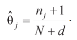

# ДЗ 1. Байесовская генерация и автоэнкодеры

## 1. Байесовский генератор стилей

1. Используя данные о популярных стилях из файла styles.py написать генератор (можно в виде функции, можно в виде класса [generator](https://wiki.python.org/moin/Generators)), который на основе формулы MLE и формулы Байеса о полной вероятности генерирует случайный стиль и 
возвращает его вероятность генерации.

Пример:

```
{'прическа': 'короткая волнистые', 
'цвет волос': 'серебристо серый', 
'аксессуар': 'нет очков', 
'одежда': 'футболка с круглым вырезом', 
'цвет одежды': 'зеленый'}
```

Вероятность: 0.00020382772154850366
2. Используя в качестве фичей пиксели изображений (см папку avatars) написать генератор аватаров.
Генератор выбирает значение каждого канала каждого пикселя, используя распределение вероятностей, полученных на основе изображений avatars

Полиномиальная модель:
    


|  |  |  |  |  |
|------------------------|------------------------|------------------------|------------------------|------------------------|

Аддитивное сглаживание (MLE):



|  |  |  |  |  |
|--------------------------------|--------------------------------|--------------------------------|--------------------------------|--------------------------------|

## 2. Автоэнкодер

[Описание задачи и решение c автоэнкодером и выбором границы](https://github.com/sad-bkt/computer_vision_course/tree/Lab2/Lab2)

[//]: # (Решение с архитектурой [MNAD]&#40;https://github.com/cvlab-yonsei/MNAD&#41;)

[//]: # (1. Обучить)

[//]: # (2. Визуализировать кластеры скрытого пространства)
