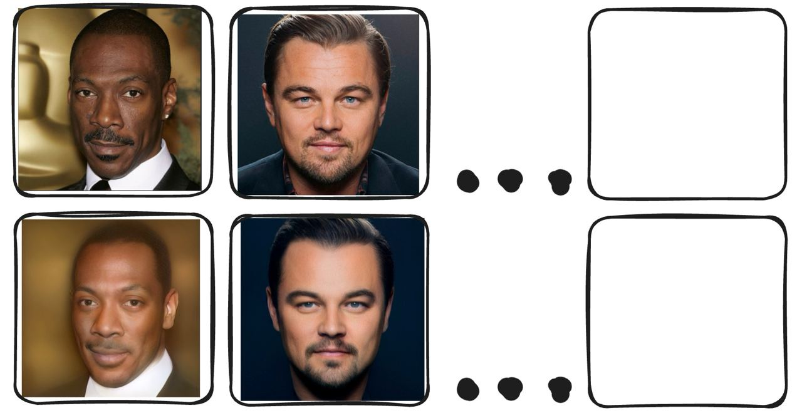
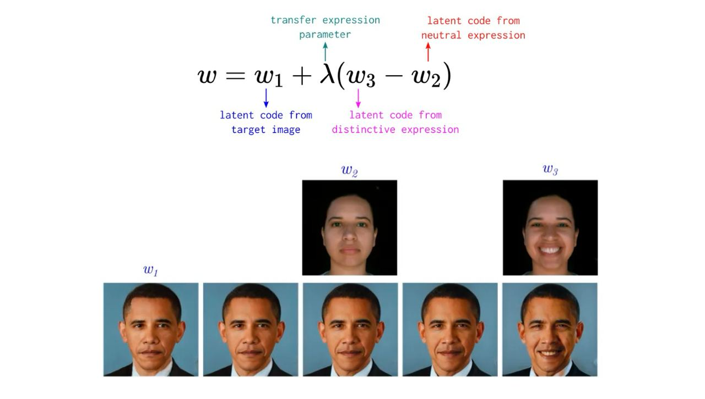

# ДЗ 3. Sampling в латентном пространстве StyleGAN


Для ДЗ надо взять **4-6 персонажей**, в наборе должны быть хотя бы 2 фото с разными поворотами головы помимо смотрящих прямо

[Ссылка на код](https://www.kaggle.com/code/anastasiiasemina1/stylegan-hw)

## Подготовительный этап
- Кадрировать изображения для соответствия данным из трейна, блок (Align images)
- Найти проекции изображений в пространстве StyleGAN, методами из ноутбука (советую добавить scheduler, поиграться с весами лоссов или использовать свои, если они улучшают качество)
- Результат представить как таблицу оригинал и проекция, написать каким образом были получены, encoder, оптимизация, лоссы и тд




| Оригинал                                                                                                                                                     | Проекция1                                                         | Проекция2                                                              | Проекция3                                                                 |
|--------------------------------------------------------------------------------------------------------------------------------------------------------------|-------------------------------------------------------------------|------------------------------------------------------------------------|---------------------------------------------------------------------------|
| &nbsp;&nbsp;&nbsp;&nbsp;&nbsp;&nbsp;&nbsp;&nbsp;&nbsp;&nbsp;&nbsp;&nbsp;&nbsp;&nbsp;&nbsp;&nbsp;&nbsp;&nbsp;&nbsp;&nbsp;&nbsp;&nbsp;&nbsp;&nbsp;&nbsp;&nbsp; | num_steps = 150 <br> initial_lr = 0.05 <br> w_avg_samples = 10000 | num_steps = 300 <br> initial_lr = 0.1 <br> w_avg_samples = 10000       | Encoder&nbsp;&nbsp;&nbsp;&nbsp;&nbsp;&nbsp;&nbsp;&nbsp;&nbsp;&nbsp;&nbsp; |
|                                                                                                                                        |                         |                |                     |
|                                                                                                                          |                 |        |             |
|                                                                                                                          |                     |            |                 |
|                                                                                                                          |           |  |       |


## Style transfer


- Изменяется цвет, свет, текстура, но человек должен остаться прежним
- Пробуем самый простой метод для трансфера стиля с одного лица на другой с помощью смешивания векторов, хватит трех стилей (еще три изображения помимо базовых, не забывайте, что стили тоже надо спроецировать в латентное пространство)
- Результат в виде таблицы с пояснениями, какие брали индексы из вектора W+

```
psi=0.1
индексы стиля [0, 8]
```

| Оригинал                             | Стиль1                                                                         | Стиль2                                                                         | Стиль3                                                                         |
|--------------------------------------|--------------------------------------------------------------------------------|--------------------------------------------------------------------------------|--------------------------------------------------------------------------------|
|                                      |                                                |                                                |                                                |
|                |                |                |                |
|  |        |        |        |
|  |            |            |            |
|  |  |  |  |


## Expression Transfer

- Три любые эмоции по аналогии с предыдущими пунктами
- Результат в таблицу

```
psi=0.6
индексы стиля [0, 17]
```

| Оригинал                             | Улыбка                                                           | Возраст                                                      | Поворот                                                        |
|--------------------------------------|------------------------------------------------------------------|--------------------------------------------------------------|----------------------------------------------------------------|
|                |                |                |                |
|  |        |        |        |
|  |            |            |            |
|  |  |  |  |


## Face swap
- В блоке Homework в ноутбуке, уже написан Arcface лосс (веса модели по ссылке) добавить его в пайплайн оптимизации и попробовать с помощью оптимизации градиента перенести личность с одной фотографии на другую, сохраняя при этом угол поворота и цвет для исходного лица.
- Сделать табличку пересадки лиц каждого с каждым

