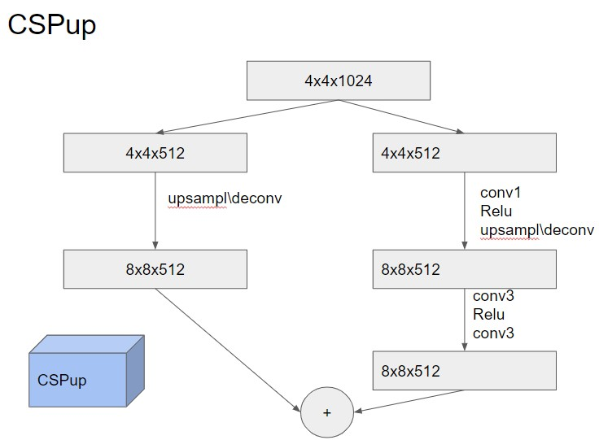

# ДЗ 2. Имплементация GAN

## Задание
1. Скачать датасет [CelebA](https://mmlab.ie.cuhk.edu.hk/projects/CelebA.html) (можно через [pytorch](https://pytorch.org/vision/stable/generated/torchvision.datasets.CelebA.html))
2. Имплементировать CSPup блок (5 баллов)

3. Имплементировать генератор GAN по заданной архитектурной схеме (10 баллов)

4. Обучить имплементированный GAN (5 баллов)
5. Добиться сходимости (регуляризации, изменение архитектуры, фишки с train loop) (10 баллов)

## Решение

[Ссылка на решение](https://www.kaggle.com/code/anastasiiasemina1/dcgan)

### Эксперимент 0

За основу взят DCGAN, имплементирован CSPup блок и генератор по заданной архитектурной схеме.


Далее описаны эксперименты для получения сходимости:

### Эксперимент 1
```
batch_size 256 -> 768
ReLU -> LeakyReLU в Генераторе
num_epochs 5 -> 10
```


График изменения лосса не особо изменился, сходимости так и нет, все генерируемые изображения одинаковые, значит, имеет место mode collapse.

### Эксперимент 2
```
последний слой в Генераторе LeakyReLU -> Tanh 
```


График изменения лосса сильно улучшился, это подтверждают и получившиеся изображения, которые стали больше похожи на реальные, все еще есть mode collapse.


